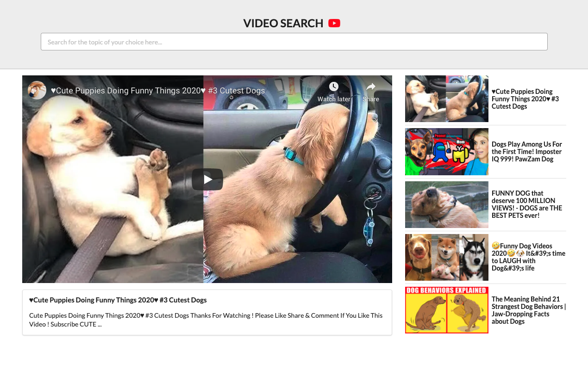

# About

This is a video search application created in ReactJs that uses youtube API V3 to complete a video search for users. Customers can search for their favourite videos from their loved content creators on youtube by clicking and typing in their favorite music-videos, vlogs, etc. It was designed using React hooks to filter favorite video.

 

# Technologies used
- React.js
- CSS
- JavaScript.js

# Integrations
- Youtube API V3
- Semantic UI

# How to get Started

1. Clone the project by keying "git clone https://github.com/MajorReact/youtube_video_search_1.0" into your terminal.
2. Navigate to folder by keying 'cd youtube_video_search_1.0" into your terminal.  
3. Run the application by keying "npm start" in your terminal. If it doesn't automatically load, you can go to http://localhost:3000 in your browser to view the application.

Nnamdi S. Ogbangwo
https://sambuildsportfolio.herokuapp.com/